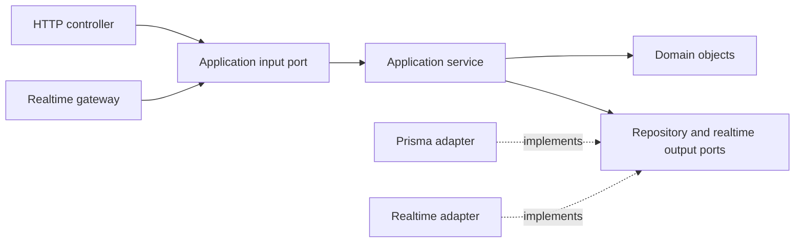

# Domain modules

Bare-bones DDD and hexagonal scaffold grouped by the nine Prisma domain files:
core, genetics, government, health, marketplace, media, ops, reproduction, trust.
Entity shells cover all 137 models, including association records. They are not
assumed to be aggregate roots; define aggregate boundaries and value objects
when implementing business invariants. Revisit the broad core boundary as its
identity, farm registry, pedigree, and notification use cases become clearer.

Each module contains:

- `domain/`: entity, value-object, and domain-event shells; no framework imports.
- `application/`: a service, input/output ports, and DTO shell; no Nest or Prisma imports.
- `infrastructure/`: Prisma repository, mapper, and outbound realtime adapter shells.
- `presentation/`: HTTP controller and incoming realtime gateway shells.
- `<name>.module.ts`: Nest composition and port-to-adapter bindings.

Use direct application service calls for reads and writes. No CQRS, command/query
handlers, buses, event sourcing, endpoints, database operations, or realtime
transport are implemented. Empty ports deliberately leave contracts undefined.
Domain event shells represent future business facts, not an event bus.

Keep cross-module interactions behind application ports, using IDs or DTOs;
do not import another module's repository or Prisma types into the domain.
Realtime subscriptions and publication are separate adapter responsibilities.
When implementing them, define authorization and audience scope, publish only
after persistence commits, and choose delivery/reconnect guarantees explicitly.

`ModulesModule` composes all nine modules and is imported by `AppModule`.
